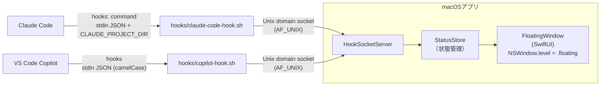

# AI Progress Monitor

Claude Code と VS Code Copilot の hooks を使って AI の状態をリアルタイム監視し、  
「どのプロジェクトで・AIが何をしているか・そこから何秒経過しているか」を  
**常に最前面に浮かぶ小さなウィンドウ**に表示し続けるMacアプリ。

---

## アーキテクチャ



---

## ファイル構成

```
AIProgressMonitor/
├── AIProgressMonitorApp.swift  # エントリーポイント・NSWindowセットアップ
├── HookSocketServer.swift    # Unix socketサーバー・HookEvent定義
├── StatusStore.swift         # セッション状態管理（ObservableObject）
├── FloatingWindowView.swift  # 浮きウィンドウのSwiftUI View
├── MenuBarView.swift         # メニューバーPopover
└── Models.swift              # SessionState / Status 定義

hooks/
├── claude-code-hook.sh       # Claude Codeフック用スクリプト
├── copilot-hook.sh           # VS Code Copilotフック用スクリプト
└── copilot-hooks.json        # Copilotフック設定テンプレート
```

---

## セットアップ

詳細は [docs/setup.md](docs/setup.md) を参照してください。

---

## Unix socket パス

`~/Library/Application Support/AIProgressMonitor/monitor.sock`

---

## テスト用（ソケットに直接送信）

```bash
# アプリ起動後
echo '{"session_id":"test-1","project_dir":"/Users/you/my-project","event":"PreToolUse","tool_name":"Bash","tool_detail":"npm test","model":null,"timestamp":'$(date +%s)'}' \
  | nc -U "$HOME/Library/Application Support/AIProgressMonitor/monitor.sock"
```

---

## 注意事項・制約

- **ローカル完結**: Unix socketはローカルのみ。外部送信なし
- **プロジェクト名**: `CLAUDE_PROJECT_DIR` の basename を表示
- **入力待ち検知**: `Notification(idle_prompt)` フックで明示的に検知（タイマー推定不要）
- **ウィンドウ操作**: `isMovableByWindowBackground = true` でドラッグ移動可
- **Copilot対応**: VS Code Copilot hooks経由で対応済み（`hooks/copilot-hook.sh`）。ただし `Notification`/`SessionEnd` イベントがないため、入力待ち検知・セッション自動削除は非対応
