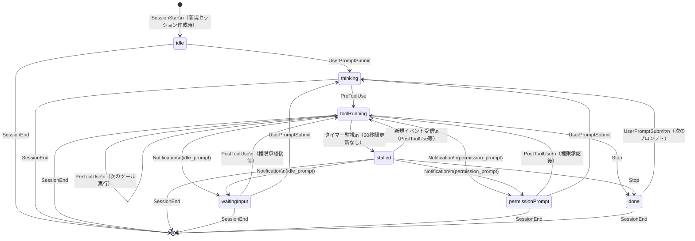

# セッション状態遷移

イベント受信時のステータス変遷を示す図です。

## 状態一覧

| 状態 | 説明 | 色 |
|------|------|-----|
| `idle` | 待機中（セッション開始直後） | グレー |
| `thinking` | AIが思考中 | ブルー |
| `toolRunning` | ツール実行中 | ブルー |
| `stalled` | ツール実行のまま30秒以上更新なし（入力待ち疑い） | オレンジ |
| `waitingInput` | ユーザー入力待ち（`idle_prompt` 通知受信） | オレンジ |
| `permissionPrompt` | 権限確認待ち（`permission_prompt` 通知受信） | オレンジ |
| `done` | 完了 | グレー |

## 状態遷移図

## 音通知のタイミング

以下の状態遷移時に通知音（ビープ音）が鳴ります：

- 非オレンジ状態 → オレンジ状態（`stalled` / `waitingInput` / `permissionPrompt`）へ遷移したとき
- `done` 以外の状態 → `done` へ遷移したとき

## 補足

- **stalled 判定**: タイマーが10秒ごとに `toolRunning` セッションを監視し、最終イベントから30秒以上経過していれば `stalled` に切り替えます
- **セッション上限**: 最大20セッションを保持。超過時は最終イベントが古いセッションから削除されます
- **Copilot の制限**: VS Code Copilot hooks では `Notification` / `SessionEnd` イベントが発生しないため、`waitingInput` / `permissionPrompt` への遷移およびセッション自動削除は非対応です
